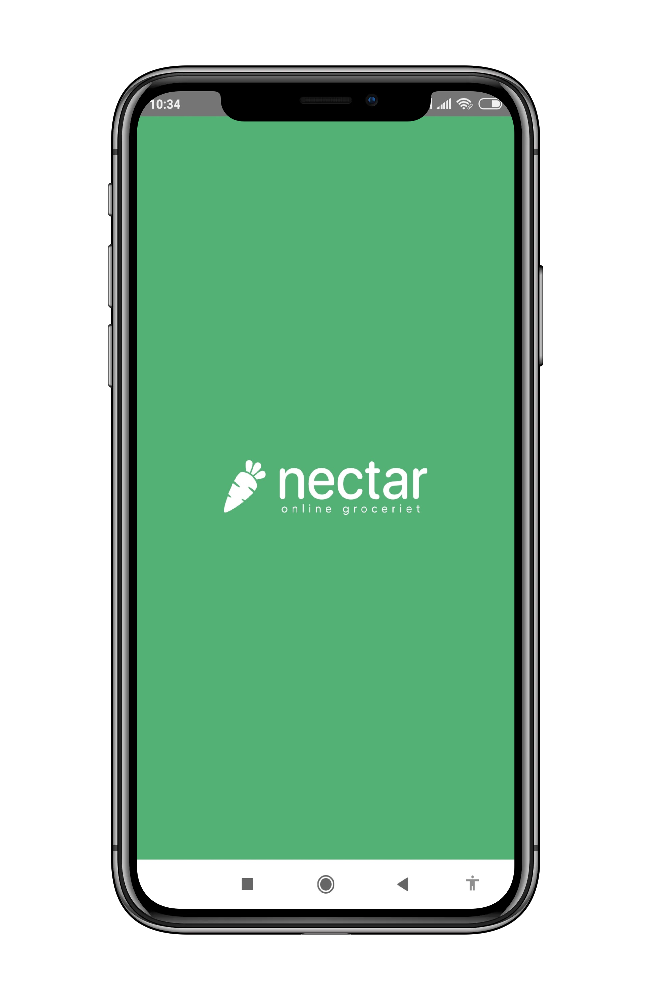
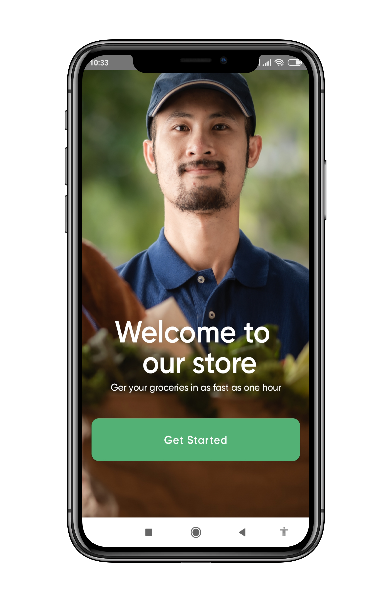
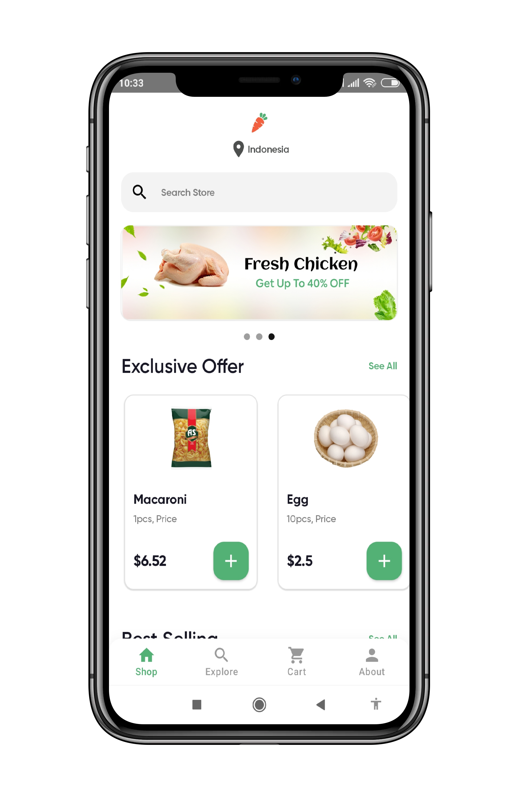
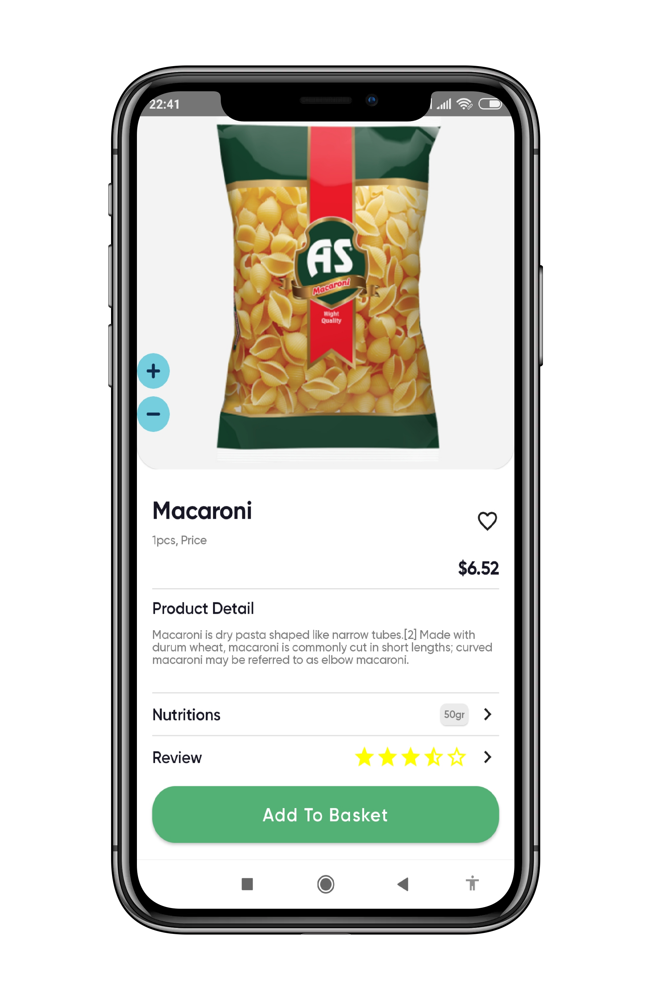
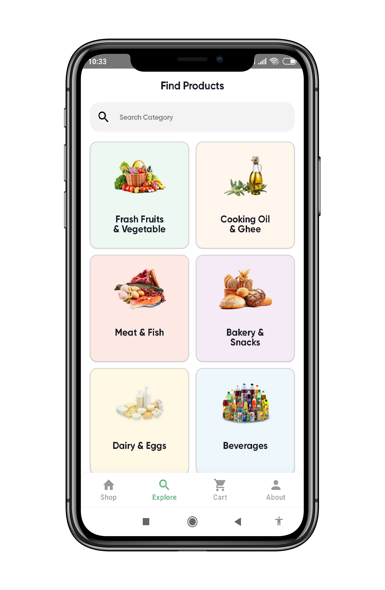
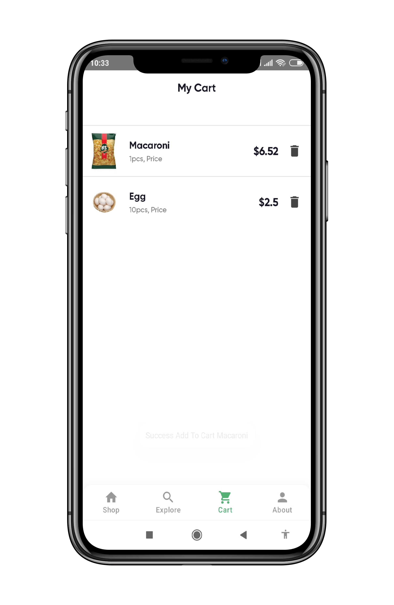
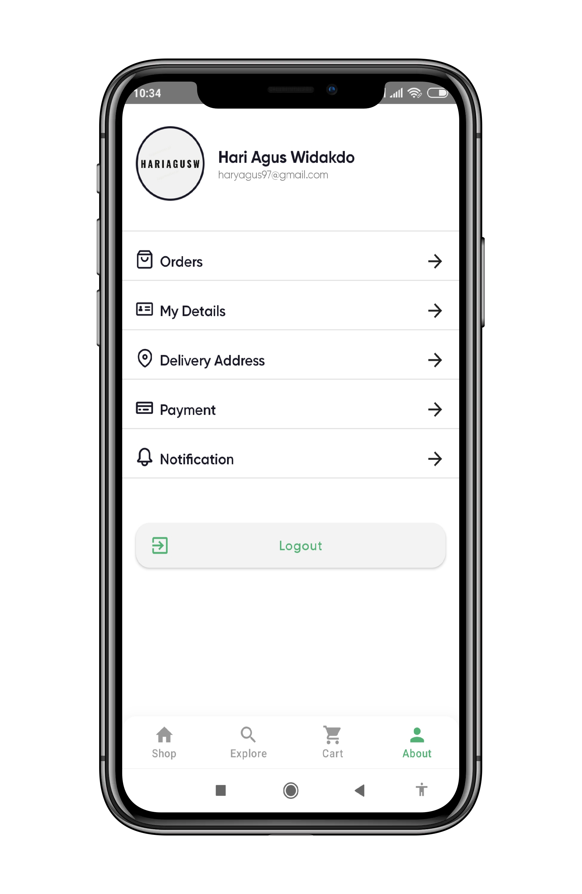
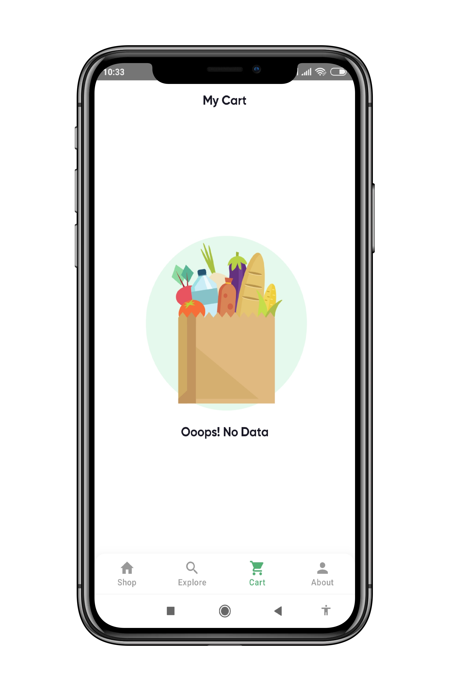

<<<<<<< HEAD
<h1 align="center">
  Groceries App
</h1>
## Introduction

This project uses jetpack compose technology,  in short jetpack Compose is Android’s recommended modern toolkit for building native UI. It simplifies and accelerates UI development on Android. Quickly bring your app to life with less code, powerful tools, and intuitive Kotlin APIs.

# Preview App
| Splash Screen  | On Boarding Screen | Home Screen | Detail Screen |
| ------------- | ------------- | ------------- | ------------- |
|   |   |  |  |

| Category Screen  | Cart Screen | Profile Screen | Empty Screen |
| ------------- | ------------- | ------------- | ------------- |
|   |   |  |  |

## Tech Stack
- MVVM (Model View View Model)
- Use Case (for interaction data)
- Room Database
- Clean Architecture (data, domain, layer)
- Clean Code

## Dependencies
- [Compose UI](https://developer.android.com/jetpack/androidx/releases/compose-ui)
- [Dagger-Hilt](https://developer.android.com/training/dependency-injection/hilt-android)
- [Room Database](https://developer.android.com/training/data-storage/room)
- [Accompanist System UI Controller](https://google.github.io/accompanist/systemuicontroller/)
- [Pager](https://google.github.io/accompanist/pager/)
- [Data Store](https://developer.android.com/topic/libraries/architecture/datastore)

=======
# Online-Grocery-Store-Jetpack
>>>>>>> 5372df8cc4ebfc87574f82d5b0e8dab34b274fea
